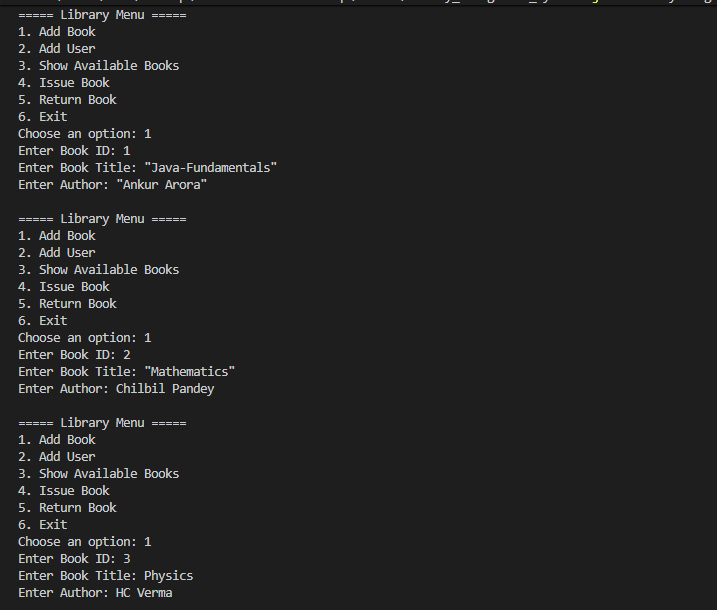
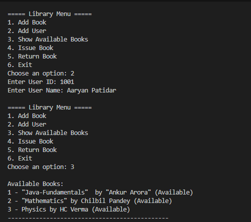
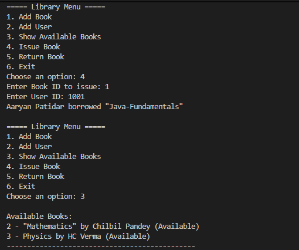
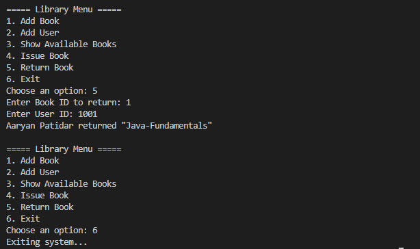

# 📚 Library Management System

A simple **console-based Library Management System** built in **Java**.  
This project demonstrates the use of **Object-Oriented Programming (OOP)** concepts such as **classes, objects, methods, encapsulation, and collections**.  

---

## ✨ Features

- ➕ Add new books to the library  
- ➕ Add new users (library members)  
- 📖 Show all available books  
- 📤 Issue a book to a user  
- 📥 Return a book to the library  
- 🛠 Simple and easy-to-understand Java code  

---

## ScreenShots
➕ Add new books to the library 

➕ Add new users and Show all available books 

 📤 Issue a book to a user

 

📥 Return a book to the library

## 🎯 Learning Outcomes

Practice with Java OOP concepts

Implementation of Collections Framework (ArrayList, etc.)

Hands-on with basic console applications

